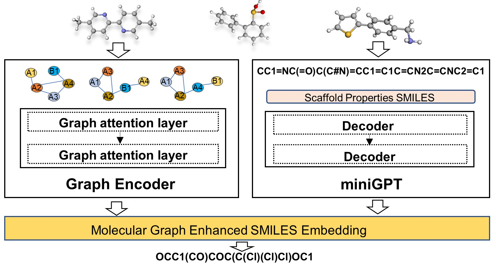

# GraphGPT
Implementation of GraphGPT: Graph enhanced GPT for conditioned molecular generation




## Note: 
The training code and the full trained model are coming soon!

## generate:
One can specify different translate configurations in `gen_guacamol.sh` as the sample code below.

To replicate our results, download the pre-trained checkpoints from [here](https://drive.google.com/drive/folders/1nvFNun0bpuKshaFl1Mo0NKHGObZcqsZS?usp=sharing).


```
python generate/generate.py
  --model_weight guacamol_sas.pt \
  --props sas \
  --data_name guacamol2 \
```


Node: 
Our code was developed with reference to the code of GPT-1 and MolGPT, and we would like to express our gratitude to them.
